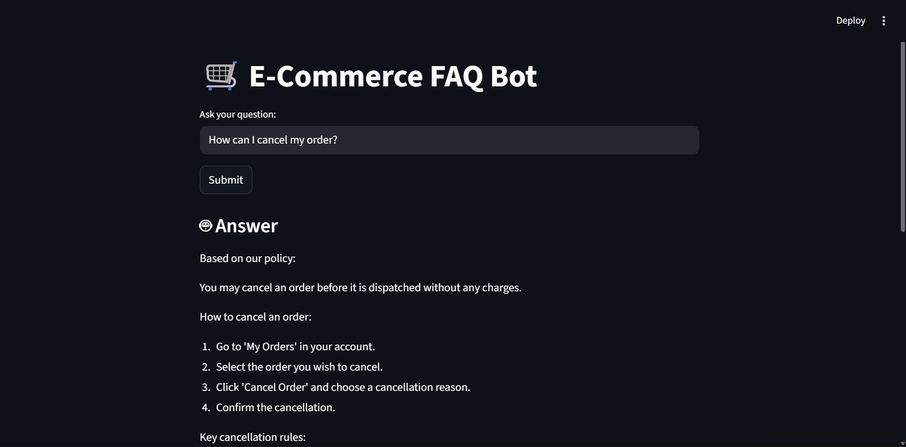
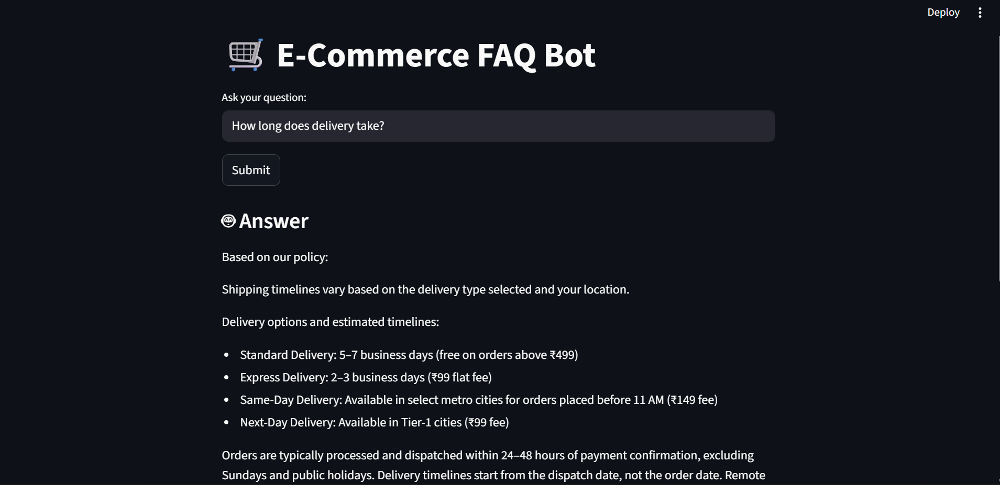
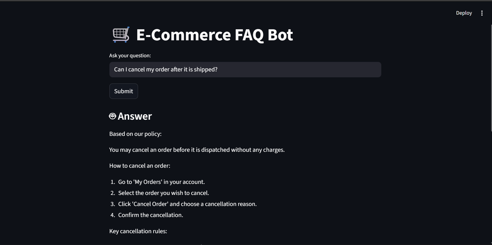

# E-Commerce FAQ Agent (RAG + LangGraph)

## Description
AI-powered FAQ assistant for e-commerce using Retrieval-Augmented Generation.

## Features
- RAG with ChromaDB
- LangGraph workflow
- Memory support
- Streamlit UI
- Memory using LangGraph Checkpointer
- Self-reflection (faithfulness scoring)

## Evaluation
- Faithfulness Score: ~0.9
- Tested on 5+ queries
- No hallucination observed

## Architecture
User Query → Embedding → ChromaDB Retrieval → LangGraph Workflow → Answer Generation → Streamlit UI

## Sample Queries
- How can I cancel my order?
- What is refund time?
- How to track my order?
- What payment methods are supported?

## Tech Stack
- Python
- Streamlit
- ChromaDB
- sentence-transformers
- LangGraph

## Live Demo
Run locally using Streamlit.

## Demo

### Cancel Order Query


### Delivery Time Query


### Another Query


## Run Locally

```bash
pip install -r requirements.txt
streamlit run capstone_streamlit.py

